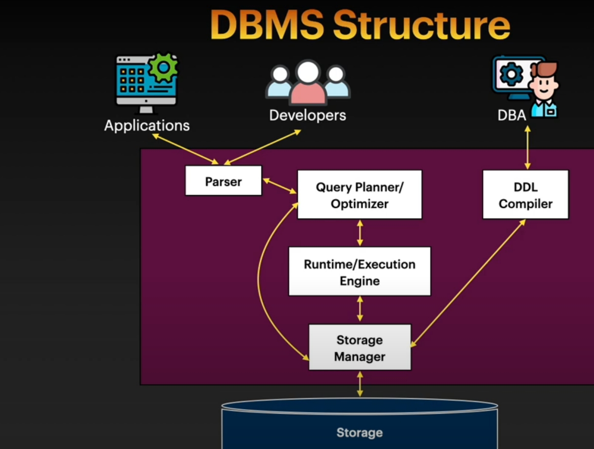
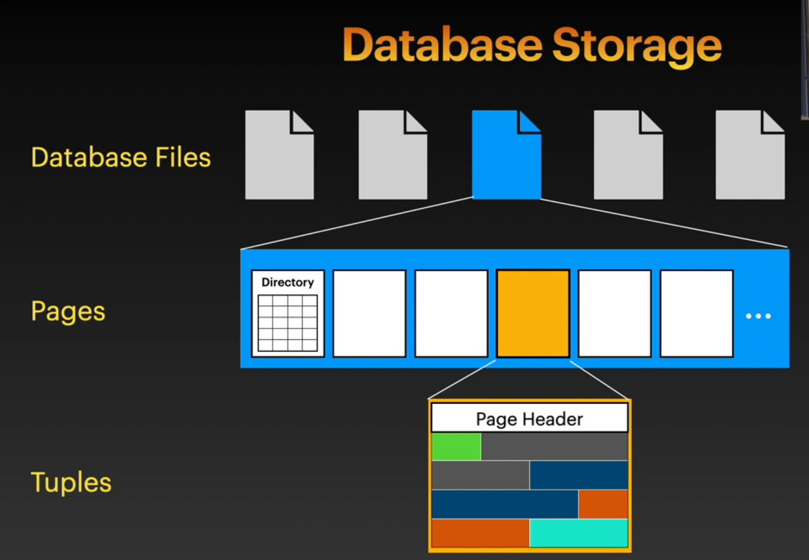
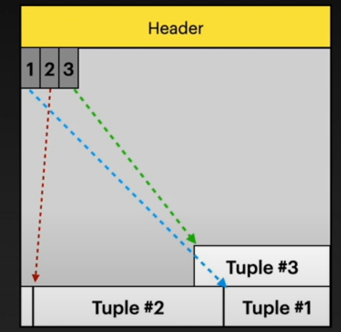
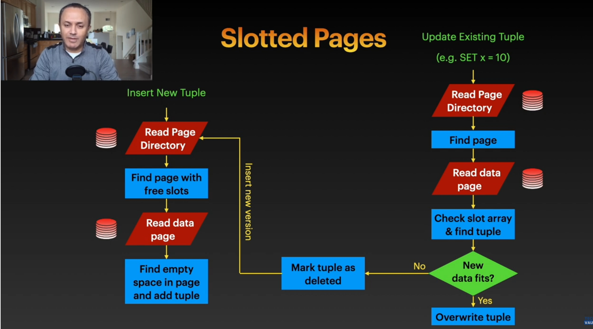
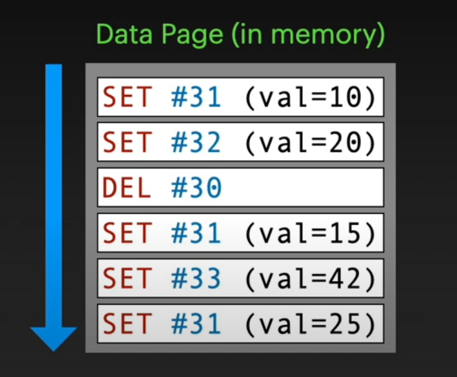
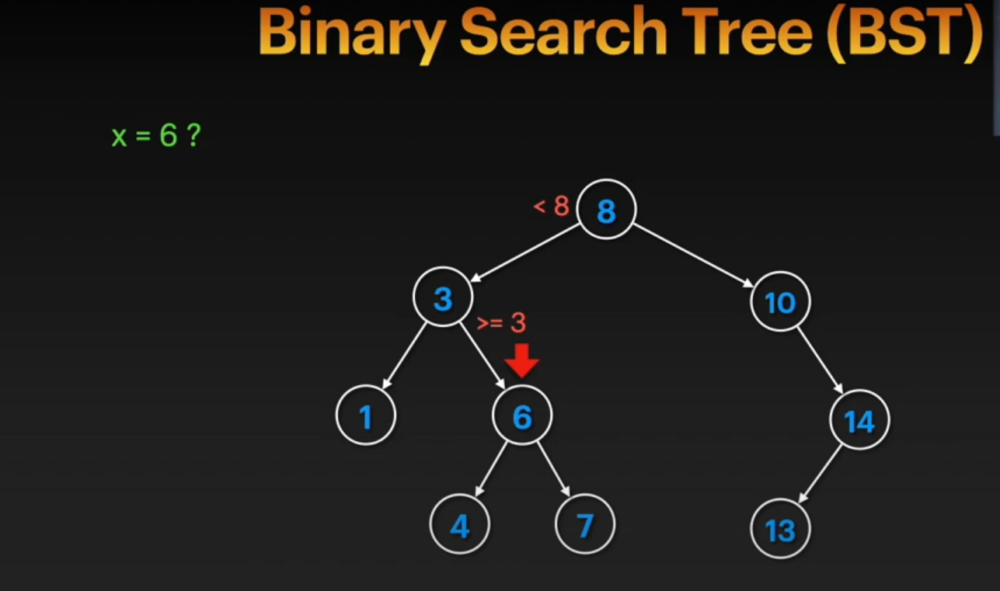
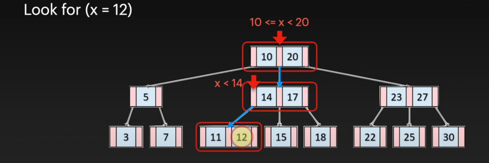
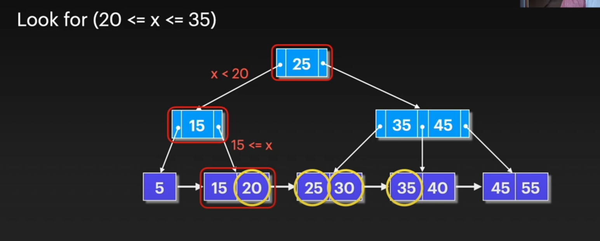

## DB STORAGE:  

Let's first examine the structure of the DBMS:

We'll observe that everyone involved in the database lifecycle—developers, admins, and users—interacts with the storage layer. Let's dive into its details.

### Properties of the Storage Layer:

- Non-volatile, retaining data without power.
- Accesses data sequentially.
- Operates on blocks or pages, not individual bytes.
- Larger capacity, lower cost, and slower performance compared to volatile storage ( memory or cache).

### Design Objectives:

- Handle data volumes exceeding available memory.
- minimize disk read/write operations.
- maximize sequential access over random access for efficiency.

### Data Movement:

The transfer of data between disk and memory is demonstrated through a scenario where the query engine, which validates, optimizes, and executes queries, requests data. If the required page is not in memory, a disk read request is issued to fetch it from the disk. The retrieved page is loaded into memory, allowing the query engine to access and process the data.

Any updates are initially applied to the in-memory copy of the page and subsequently written back to the disk.

### Storage Mnager:

The storage manager, an essential part, handles moving data between disk and memory, keeps track of where data is stored (disk or memory),and hide the details from other parts like the query engine or users. It acts as a bridge to the storage layer and works with the hardware, either directly or through the operating system, making everything simple and hidden.

### Files and Pages:

the data is stored on the storage layer as files, and the format of these files is typically system-specific ( different for Oracle and SQL Server)
Internally, a file is divided into pages, which are fixed-size blocks of data
 A page can contain various types of data, such as table rows, index entries, or catalog information. Each page has a unique ID for identification and retrieval. The storage manager maintains a mapping between these page IDs and their locations on disk or in memory

### File Organization
- Heap File Organization: Pages are stored in no particular order.
- Tree File Organization ( B+ Tree): Often used for indexes and efficient for range queries.
- Sequential  Suitable for batch processing and tape storage where data is processed sequentially.
- Hash File Organization: Primarily used for indexes, efficient for equality searches but less common than tree structure

### File and Pages
To locate a specific page, if pages were ordered and in a single file, a simple calculation based on page size and the desired page number could determine its offset. However, with multiple files or unordered pages, this direct calculation is not feasible

To address this : 
1. `metadata` is required to track which pages reside in which files and the location of pages within each file, including free space
2. `page directory` is introduced as a special page usually located at the beginning of each file. This directory acts as a table of contents, storing the location of each page within the file (page ID and file offset) and information about free slots within pages and entirely free page

### Page Layout (tuple based dbms)
A page contains records or tuples, and also includes Header (its own metadata). This metadata can include the page size, compression information, the encoding scheme used for compression, the database version and other information depending on how the data within the page is organized.

## Page Layout - To organize the data within a page:  

`Naive Approash`:                                            
where the page header stores the number of rows, and new tuples are appended at the end based on  (size * the number of existing tuples). However, this approach has limitations, particularly with deletion leading to issues in calculating the insertion point for new tuples and the assumption that all tuples have the same size which is not common.

`Slotted Page Method (sql, oracl)`:  

In this method, the beginning of the page (after the header) contains a slot array or a list of slots, where each slot contains a pointer to the location of a tuple within the page
The tuples themselves are stored starting from the end of the page and grow backwards, while the slot array grows forwards. This allows for tuples of different sizes. `Fragmentation` can occur with deletions, leaving empty space. To optimize, a compaction process can be performed.

To access a specific tuple, each tuple is typically assigned a unique `Record ID `(or Tuple ID) across the entire table. This ID provides the physical location of the tuple and is usually a combination of the file ID, page ID, and slot number.

 some systems might store the Row ID with the tuple, most keep it as an external, logical identifier

 The challenges with slotted pages include I/O overhead (read/write operations), potentially random I/O access, and fragmentation leading to wasted space

good choice in reading applications not writing.

`Log structured Method `:  
 this method stores changes to tuples in a log.

 An insert operation is a new record, a delete is a delete record with the Tuple ID, and an update can be represented as a delete of the old version followed by an insert of the new version, or sometimes as an in-place overwrite in the log.

 The log is typically stored sequentially, first in memory and then written to disk in pages once the memory buffer is full,  This results in sequential I/O for writes, and updates and deletes become simple appends to the log. There is no fragmentation

However, reading a tuple requires scanning the log (in memory and on disk) from the latest entry backwards to find the most recent version of the tuple with the given ID and also there is alot of waste space of old versions or deleted verions of a tuples which is inefficent but we can overcome this problem with index and compaction.

 Compaction involves processing the log entries and takes the latest state of each tuple into new data pages, effectively discarding older, deleted entries. After compaction, the tuples in the new pages might be sorted by Tuple ID to improve read performance, potentially allowing for binary search or the use of an index within the page header.

 the compaction process can be expensive, involving significant disk I/O and CPU usage, especially with high write volumes, potentially slowing down other operations

 good choice in Writing applications not Reading.

 `Index-Organized Tables `: 

  In this approach, the actual data of the table is stored within the index structure itself

  This can significantly speed up reads since the data is directly accessible once the index entry is found. However, writes (inserts, updates, deletes) can be slower as they require updating the index structure, which includes the actual data. This method is used in systems like SQL Server, Oracle, and MySQL 

 good choice in Reading applications not Writing.

 ___

 The choice of which page layout to use depends on the application's characteristics, such as the read/write ratio, query patterns, and data size. Some database systems offer multiple page layout options that can be chosen based on the specific needs of different tables
___
### the structure of a tuple itself:
A tuple typically has a header containing metadata (nullability information, size, whether it's part of a deleted operation) and the actual data. The database management system understands the data within the tuple based on the schema defined in the catalog.

the data is a sequnce of bytes, it is read word by word(46 bits) so if there is an atribute or more fit this size: its ok and add padding not to make the parts of one attribute in multiple words because it can be less efficient to read            
but if the attribute size more than the word size, the tuple might store a pointer to a separate page or even an external file where the actual data is stored.
___

## Database Indexes: 
#### The problem: 

When a query searches for a specific value in a large table, the database might have to perform a` full table scan`, reading every row in every page of the table to find the desired record. This is very slow, especially for tables with millions of rows

#### solutions: 
`paralles search(multiple threads)`: Using multiple read threads to scan different pages simultaneously can offer some speedup, but introduces complexity on memory and cpu and depends on the system architecture. It still requires reading all pages
___

`Partitioning: `Dividing the table into smaller portions (parts) based on the value of a specific attribute. This allows the database to only search within the relevant partition, reducing the number of pages to scan. However, partitioning is only effective when searching on the partitioned attribute, and it adds complexity to insertions to add more process to find in which partition we will add. If searching on a different attribute, a full table scan might still be necessary because we cant do partitioning on each attribute.

___
 `Indexes`: additional structure that helps to access data in a table more quickly, It stores values of certain attributes and pointers to the location of the corresponding data rows on disk.                                        This allows the database to avoid scanning the entire table. Multiple indexes can be created on different attributes.                                       
  Indexes are particularly useful for point queries (searching for a specific value) and range queries (searching for values within a certain range)

 A simple way to imagine an index is a` sorted list` of attribute values, each pointing to the location of the corresponding data. However, searching this sorted list might still require scanning the entire index (linear search(o(n))), which can be slow for large indexes.                                     
  Using binary search on the index could improve search speed, but it involves random disk access, which is inefficient. Moreover, inserting new data into a sorted list requires shifting subsequent elements, making updates expensive O(n)
___
  ` Binary Search Trees`:  is a potential improvement , searching has a logarithmic time complexity but are not always balanced, and an unbalanced tree can degenerate into a linked list, leading to linear search time.

___
  and here` B-Tree`  comes :  B-trees are balanced trees where B-Tree from (k) degree each node can have multiple (k)children and (k-1)keys, this structure reduces the number of disk accesses required for a search, searching has a logarithmic time complexity .
  
But Insertions in B-trees maintain the balanced structure by splitting nodes when they become full (rebalancing), which adds to the write cost. While B-trees are efficient for point queries, range queries can be inefficient as the required values might be scattered across different parts of the tree, requiring multiple up-and-down traversal. also there is another issue that each node stores pair of attribute value and a pointer to its location in the disk , if we can find a way to remove the pointers , each node can take more keys therefor we can reduce the number of accessed pages. so B+ Trees come.

___
B+ Tree: B+ trees are similar to B-trees, but the data pointers are only stored in the leaf nodes, and the leaf nodes are linked together. Internal nodes only contain keys and pointers to child nodes to make each node take more numbers of keys(attributes).this structure reduces the number of disk accesses required for a search  potentially allowing the entire index or a significant portion of it to reside in memory

This structure makes range queries very efficient as once the starting point of the range is found in the leaf nodes, the subsequent values can be retrieved by simply traversing the linked list of leaf nodes sequentially, minimizing random disk access

there is only issue in B+ Trees duplication of keys in the internal nodes and leaf nodes, which requires more storage spac

___
while indexes significantly speed up read operations, they can slow down write operations (inserts, updates, deletes) because the index also needs to be maintained. The choice of using indexes depends on the application's workload (read-intensive vs. write-intensive)